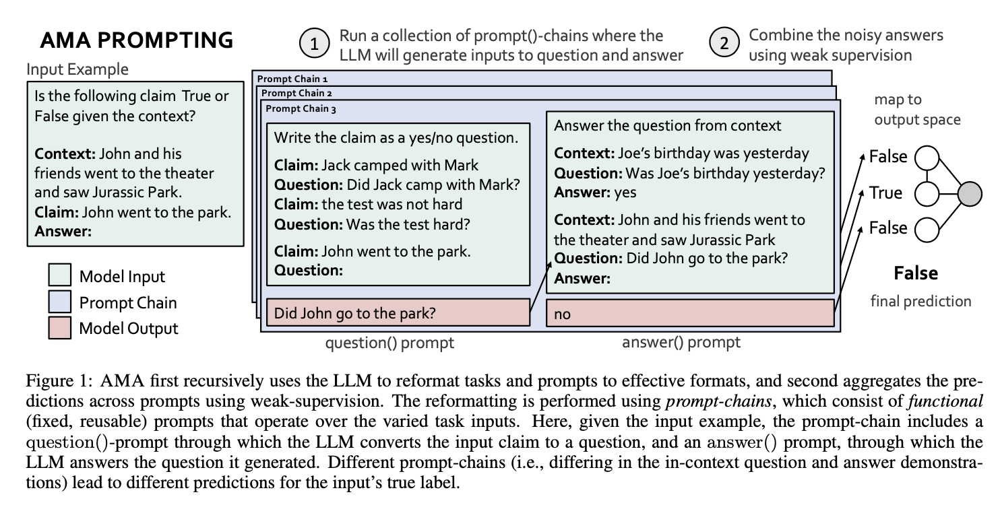
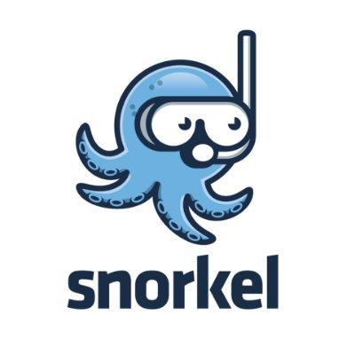
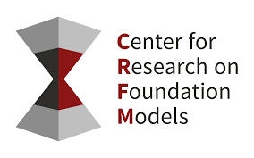

# Ask Me Anything: A simple strategy for prompting language models


[](https://together.xyz/)

This repository contains code for the Ask Me Anything (AMA) prompt-aggregation strategy. The end-to-end AMA approach includes (1) recursively using the language model to transform the task format and prompt and (2) aggregating the predictions of multiple prompts using weak supervision. We include code for both components and pointers to the publicly downloadable datasets. See our [paper](https://arxiv.org/abs/2210.02441) for more details.

<p align="center"></p>


## Table of Contents
- [Setup](#setup)
- [Data](#getting-the-data)
- [Running models](#models)
- [Running experiments](#experiments)
- [Repository Structure](#overall-repository-structure)
- [Citation](#citation)


## Setup

### Installation
Here we will setup the AMA code (prompting models for tasks), weak supervision code (aggregating predictions), and [Manifest](https://github.com/HazyResearch/manifest/) code (tooling for easily loading and running the models).

We encourage the use of conda environments:
```
conda create --name ama python=3.8
conda activate ama
```

Clone as follows:
```bash
# Ask Me Anything code
git clone git@github.com:HazyResearch/ama_prompting.git
cd ama_prompting
pip install -r requirements.txt

# Weak supervision code
cd metal-ama
git submodule init
git submodule update
pip install -e .

# Manifest 
git clone git@github.com:HazyResearch/manifest.git
cd manifest
pip install -e .
```


### Getting the data
We assume all data lives in the ```AMA_DATA``` environment variable. By default, this is set to ```/home/data```. To change this, run
```bash
export AMA_DATA=<path>
```

Please follow the instructions below to download all necessary data for experiments. 
 
1. Download the PromptSource (P3) dataset from Hugging Face at https://huggingface.co/datasets/bigscience/P3.
```bash
cd $AMA_DATA
git lfs install
git clone https://huggingface.co/datasets/bigscience/P3
```
Then run [ama_prompting/download_p3.py](./download_p3.py). We use the GPT3-Style prompts in the few-shot baseline for each benchmark.

2. We downloaded the remaining tasks from the following sources:
    * [AGNews, DBPedia, and SST2](https://github.com/tonyzhaozh/few-shot-learning)
    * [Amazon Products](https://github.com/allenai/flex/blob/75d6d1cea66df2c8a7e3d429c6af5008ccf1544b/fewshot/hf_datasets_scripts/amazon/amazon.py)
    * [Natural Questions and WebQs](https://github.com/facebookresearch/FiD)
    * [RealTimeQA](https://github.com/realtimeqa/realtimeqa_public/tree/main/past/2022) (GCS files from June 17th - July 22, 2022)
    * [ReCoRD](https://sheng-z.github.io/ReCoRD-explorer/)
    * [StoryCloze](http://goo.gl/forms/aQz39sdDrO)

### Running models
We run inference on models using a tool called [Manifest](https://github.com/HazyResearch/manifest). This tool is useful because it caches your inference results and does not require reloading the model for each new run you launch. To load the EleutherAI GPT-j-6B model, in a Tmux session, run:
```bash
python3 manifest/manifest/api/app.py \
    --model_type huggingface \
    --model_name_or_path EleutherAI/gpt-j-6B \
    --device 0
```
It will take a few minutes for large models to load! To use a different model, replace ```EleutherAI/gpt-j-6B``` with the model name. See the Manifest repo for more information on loading other models.


## Experiments

### Collecting the prompting predictions

To run a single task such as the Recognizing Textual Entailment (RTE) SuperGLUE benchmark, you can use the following steps.

1. Load a Manifest model using the above command

2. Run the following command. This will run the zero-shot baseline (```run_zeroshot = 1```), few-shot baseline (```run_fewshot = 1```) with $k$ in-context demonstrations (```k_shot = 3```), and the AMA baseline (```run_decomp = 1```). In AMA, we aggregate the predictions of multiple prompts-per-input. The number of prompts over which to aggregate is specified by ```num_boost```. 

```bash
python3 tasks/RTE_final.py \
    --run_zeroshot 1 \
    --run_fewshot 1 \
    --run_decomp 1 \
    --num_boost 5 \
    --k_shot 3 \
    --output_metrics_file ../ama_logs/metrics.json \
    --cache_connection ../ama_logs/manifest_cache.sqlite \
    --save_dir ../ama_logs/ama_final_runs
```

Please see the argparse in ```tasks/decomposition.py``` for other run options; for instance, to control Manifest's caching behavior. 

3. The results of all baselines will be saved in `ama_final_runs/<task_name>` (e.g., `<task_name>` is `super_glue_rte` as seen in the `RTE_final.py` main function) and output all performance metrics to `metrics.json`. The output appears as follows:

```
Saving to ../ama_logs/ama_final_runs/super_glue_rte/EleutherAI_gpt-j-6B_decomposed_10052022.json
Saving to ../ama_logs/ama_final_runs/super_glue_rte/EleutherAI_gpt-j-6B_decomposed_10052022_train.json
Accuracy Few Shot 0.5884476534296029
Accuracy by Boost Set Decomposed [0.592057761732852, 0.6209386281588448, 0.5848375451263538, 0.6678700361010831, 0.6173285198555957]
Accuracy by Boost Set Decomposed Average 0.6166064981949458
Accuracy Boost Decomposed 0.6642599277978339
Saved metrics to ../ama_logs/metrics.json
Saved final data to ../ama_logs/ama_final_runs/super_glue_rte
```

For the AMA baseline, which consists of ```num_boost``` prompt-chains, the metrics include the individual prompt-chain accuracies over the dataset ("Accuracy by Boost Set Decomposed"), average score ("Accuracy by Boost Set Decomposed Average"), and majority vote result ("Accuracy Boost Decomposed"). 

### Running weak supervision

4. Next we aggregate over the predictions with weak supervision (WS). In order to run the WS algorithm on the predictions which were saved down in `ama_final_runs/super_glue_rte`, use the following command. By default, we assume the date of the log file is today. You can change it with the `--override_date` command.

```bash
python3 boosting/run_ws.py \
--task_name super_glue_rte \
--data_dir ../ama_logs/ama_final_runs \
--model_prefix EleutherAI_gpt-j-6B \
--override_date 10052022
```

The output will include the following results:

```
# The code will first output results without modelling dependencies.  

Trained Label Model Metrics (No deps):
Accuracy: 0.650
Precision: 0.724
Recall: 0.420
F1: 0.531

# For this task, the WS algorithm identifies a dependency between prompts 0 and 2. Next the code outputs results after modelling dependencies, if dependencies are recovered above.

Trained Label Model Metrics (with deps):
Accuracy: 0.751
Precision: 0.758
Recall: 0.695
F1: 0.725


# Conditional entropy metric discussed in the paper 

H(Y | WS output): 0.5602824867598865
```

For this task, [Brown et al., 2020](https://arxiv.org/pdf/2005.14165.pdf) reports accuracy metrics.


## Overall repository structure
```
tasks/           code for running inference on tasks
diagnostics/     contains the diagnostic tasks
boosting/        code for running weak supervision
metal-ama/       weak supervision algorithm
manifest/        code for loading and using models
/home/data/      default location for benchmarks
```


## Citation
If you use this codebase, or otherwise found our work valuable, please cite:
```
@article{arora2022ama,
  title={Ask Me Anything: A simple strategy for prompting language models},
  author={Arora, Simran and Narayan, Avanika and Chen, Mayee F. and Orr, Laurel and Guha, Neel and Bhatia, Kush and Chami, Ines and Sala, Frederic and R\'e, Christopher},
  journal={arXiv:2210.02441},
  year={2022}
}
```

As well as [Snorkel MeTaL](https://github.com/HazyResearch/metal), [bigscience P3](https://huggingface.co/datasets/bigscience/P3), and the benchmark authors.

## Acknowledgements

We are very grateful to the following organizations for the resources that made this work possible: [Together Computer](https://together.xyz/), [Numbers Station](https://numbersstation.ai/), [Snorkel](https://snorkel.ai/), [Stanford Center for Research on Foundation Models](https://crfm.stanford.edu/) and [Stanford HAI](https://hai.stanford.edu/). 

<p float="center">
  
  
  
</p>

